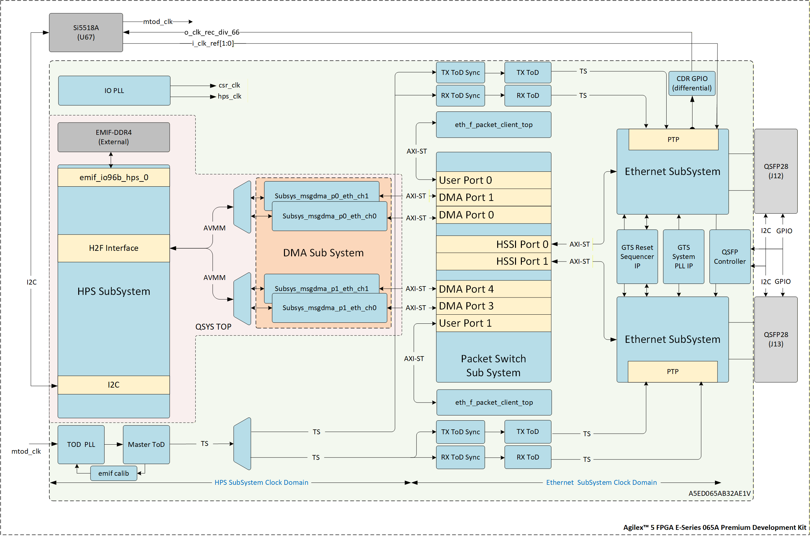

# 2-Port 25GbE Agilex&trade; 5 Precision Time Protocol(IEEE 1588v2) System Example Design

## Description

The 2-Port 25GbE  Agilex &trade; 5 Precision Time Protocol(IEEE 1588v2) System Example Design includes two Ethernet ports with built-in 2-step hardware PTP timestamping capabilities. The integrated Agilex&trade; 5 Hard Processor System (HPS) operates a PTP software stack that complements the hardware-based timestamping functionality.



## Repository Structure

Directory Structure Used in This Example Design:

``` bash
agilex5-ed-ptp
|--- a5e065a-prem-devkit-exp-prod/
  |   |--- src
  |   |   |--- hw
  |   |   |--- sw
  |....
```

## Project Details

- **Family**: Agilex&trade; 5 E-Series( Group A)
- **Quartus Version**: 26.1
- **Development Kit**: Agilex&trade; 5 FPGA E-Series 065A Premium Development Kit([DK-A5E065AB32AEA](https://www.altera.com/products/devkit/po-3285/agilex-5-fpga-e-series-065a-premium-development-kit))
- **Device Part**: A5ED065AB32AE1V
- **Release TAG** : SED-2X25GE_PTP-a5e065a-pdk-Q26.1-Rel1.1

## Getting Started

Building the design is easy with the scripts provided in the repo. Clone the repository to get the source files

``` bash
git clone https://github.com/altera-fpga/agilex5-ed-ptp.git
cd agilex5-ed-ptp
git checkout <Release TAG>
cd a5e065a-prem-devkit-exp-prod
export TOP_FOLDER=`pwd`
mkdir bin
```

Follow the below procedure to build the Hardware design and Software artifacts.

- [Building the Hardware](./src/hw)
- [Building the software](./src/sw)
